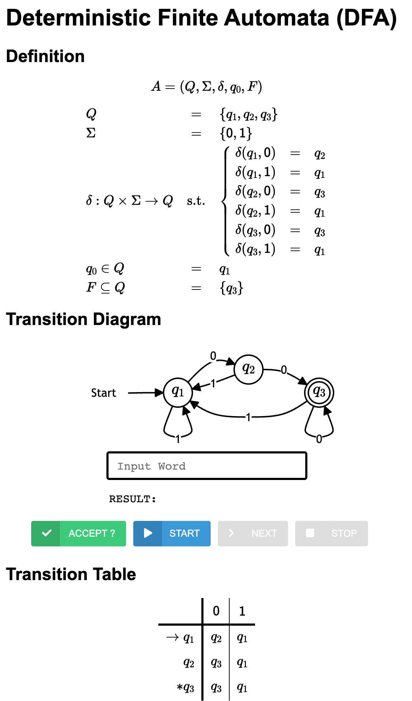

# Regular Expression과 Finite Automata의 동치성

[English](./README.md) | [한국어](./README.ko.md)

다음과 같이 `sbt`를 이용하여 템플릿 코드를 다운로드 받으세요:
```bash
sbt new ku-plrg-classroom/equiv-re-fa.g8
```

> :warning: 아직 [공용 지침서](https://github.com/ku-plrg-classroom/docs/blob/main/README.ko.md)를 읽지 않았다면, 이 문서부터 읽어주세요.

템플릿 코드는 다음과 같은 파일들을 포함합니다:
<pre><code>equiv-re-fa
├─ viewer
│  ├── index.html ────────────── Automata viewer를 위한 HTML 파일
│  ├── js/data.js ────────────── Automata의 데이터를 저장하는 JavaScript 파일
│  └── ...
└─ src
   ├─ main/scala/kuplrg
   │  ├── FA.scala ────────────── Finite automata (FA)의 공통 기능
   │  ├── DFA.scala ───────────── Deterministic finite automata (DFA)의 정의
   │  ├── NFA.scala ───────────── Nondeterministic finite automata (NFA)의 정의
   │  ├── ENFA.scala ──────────── ε-Non-deterministic finite automata (ε-NFA)의 정의
   │  ├── RE.scala ────────────── Regular expressions (REs)의 정의
   │  ├── Implementation.scala ── <b style='color:red;'>[[ 이 파일을 수정하고 제출하세요. ]]</b>
   │  ├── Template.scala ──────── 구현해야 할 함수들의 템플릿
   │  ├── basics.scala ────────── 기본 함수들의 정의
   │  └── error.scala ─────────── `error` 함수의 정의
   └─ test/scala/kuplrg
      ├─ Spec.scala ───────────── <b style='color:red;'>[[ 이 파일에 테스트 케이스를 추가하세요. ]]</b>
      └─ SpecBase.scala ───────── 테스트 케이스의 공통 기능</code></pre>

**이 숙제의 목표는 `Implementation.scala` 파일에 `re2enfa` 함수와 `dfa2re` 함수를 구현하는 것입니다.**

- [(문제 #1) Regular Expressions에서 ε-Nondeterministic Finite Automata (50점)](#문제-1-regular-expressions에서-ε-nondeterministic-finite-automata-50점)
- [(문제 #2) Deterministic Finite Automata에서 Regular Expressions (50점)](#문제-2-deterministic-finite-automata에서-regular-expressions-50점)
- [부록](#부록)
  - [Automata Viewer](#automata-viewer)
  - [`dfa2re`의 디버깅](#dfa2re의-디버깅)
  - [DFA의 짧은 정의](#dfa의-짧은-정의)
  - [Regular Expression의 String 형태](#regular-expression의-string-형태)


## (문제 #1) Regular Expressions에서 ε-Nondeterministic Finite Automata (50점)

첫 번째 문제는 **regular expression**을 <strong>ε-Nondeterministic Finite
Automata (ε-NFA)</strong>로 변환하는 `re2enfa` 함수를 구현하는 것입니다.

권장하는 방법은 `Template.scala` 파일에 정의된 `SimpleENFA` 클래스를 사용하는
것입니다. 이 방법으로 구현하고자 한다면, `re2enfa` 함수는 다음과 같이 이미
구현되어있습니다:

```scala
  // Convert a regular expression to a epsilon-NFA
  def re2enfa(re: RE): ENFA =
    def re2enfa(re: RE): ENFA =
      val SimpleENFA(from, trans, to) = re2senfa(re, 1)
      val states = (from to to).toSet
      val symbols = trans.flatMap((_, aOpt, _) => aOpt)
      val map = trans.groupMap((i, aOpt, _) => (i, aOpt))((_, _, j) => j)
      val enfaTrans = states
        .flatMap(q => symbols.map(a => q -> Option(a)) + (q -> None))
        .map(pair => pair -> map.getOrElse(pair, Set()))
        .toMap
      ENFA(
        states = states,
        symbols = symbols,
        trans = enfaTrans,
        initState = from,
        finalStates = Set(to),
      )
```

따라서, `re2senfa` 함수만 구현하면 됩니다. `re2senfa` 함수는 **regular
expression**을 주어진 **initial state**를 가지는 **simplified ε-NFA**로
변환하는 함수입니다:

```scala
  // Convert a regular expression `re` to a simplified epsilon-NFA with an
  // initial state `i`.
  def re2senfa(re: RE, i: State): SimpleENFA = re match
    case REEmpty() => ???
    case REEpsilon() => ???
    case RESymbol(symbol) => ???
    case REUnion(re1, re2) => ???
    case REConcat(re1, re2) => ???
    case REStar(re) => ???
    case REParen(re) => ???
```

> :warning: 하지만, `re2enfa` 함수를 `SimpleENFA` 클래스를 사용하지 않고
> 구현하고자 한다면, 그렇게 해도 상관은 없습니다.


### 테스트 케이스

`Spec.scala` 파일에 테스트 케이스가 정의되어 있고, `Spec.scala` 파일에 자신만의
테스트 케이스를 추가할 수 있습니다. 테스트 케이스는 `sbt test`를 실행할 수
있습니다.

테스트 케이스는 regular expression의 string 형태를 사용하여 정의되어 있습니다.
이 string 형태 대한 설명은 [Regular Expression의 String
형태](#regular-expression의-string-형태)를 참고하세요.

또한, `ENFA` 클래스의 `dump` 함수를 사용하여 구현체를 디버깅할 수 있습니다.
자세한 내용은 [Automata Viewer](#automata-viewer) 부분을 참고하세요.


## (문제 #2) Deterministic Finite Automata에서 Regular Expression (50점)

두 번째 문제는 <strong>deterministic finite automaton (DFA)</strong>를 **regular
expression**으로 변환하는 `dfa2re` 함수를 구현하는 것입니다:

```scala
  // Convert a DFA to a regular expression
  def dfa2re(givenDFA: DFA, debug: Boolean = false): RE =
    val dfa = givenDFA.normalized

    // Show details in the conversion from a DFA to a regular expression
    if (debug)
      show("* Details in the conversion from a DFA to a regular expression:")
      val n = dfa.states.size
      for (k <- 0 to n; i <- 1 to n; j <- 1 to n)
        val re = reForPaths(dfa)(i, j, k)
        println(s"  - ($i, $j, $k) -> ${re.shortFormat}")

    ???
```

권장하는 방법은 `reForPaths` 함수를 사용하는 것입니다. 이 함수는 주어진 DFA의
**경로의 집합**을 나타내는 **regular expression**을 생성합니다. 이 방법으로
구현하고자 한다면, `dfa2re` 함수의 나머지 부분과 `reForPaths` 함수의 내용을
구현하면 됩니다:

```scala
  // A regular expression accepting paths from `i` to `j` with intermediate
  // states bounded by `k` in a given DFA `dfa`. Assume that the given DFA
  // `dfa` is already normalized (i.e., the states of DFA are 1, 2, ..., n).
  def reForPaths(dfa: DFA)(i: State, j: State, k: State): RE = k match
    case 0 => ???
    case _ => ???
```

> :warning: 하지만, `reForPaths` 함수를 사용하지 않고 `dfa2re` 함수를 구현하고자
> 한다면, 그렇게 해도 상관은 없습니다.

디버깅을 위해, `dfa2re` 함수의 `debug` 옵션을 사용할 수 있습니다. 자세한 내용은
[`dfa2re`의 디버깅](#dfa2re-의-디버깅) 부분을 참고하세요.

### 테스트 케이스

`Spec.scala` 파일에 테스트 케이스가 정의되어 있고, `Spec.scala` 파일에 자신만의
테스트 케이스를 추가할 수 있습니다. 테스트 케이스는 `sbt test`를 실행할 수
있습니다.

테스트 케이스는 DFA의 짧은 정의을 사용하여 정의되어 있습니다. 이 짧은 정의에
대한 설명은 [DFA의 짧은 정의](#dfa의-짧은-정의)를 참고하세요.


## 부록


### Automata Viewer

> :warning: 만약에 automata viewer를 사용하지 않고 싶다면, 이 설명을 건너뛰어도
> 됩니다. 하지만, 구현체의 디버깅을 위해서 automata viewer를 사용하는 것을
> **매우 권장**합니다.


`FA` 클래스의 `dump` 함수를 사용하여 구현체를 디버깅할 수 있습니다. 이
함수는 `viewer/js/data.js` 파일에 automata를 HTML 형태로 출력합니다.

예를 들어, 다음과 같이 `dfa`라는 이름의 DFA를 정의하고:

```scala
// A short definition: DFA(3, "01", 181, 4)
val dfa: DFA = DFA(
  states = Set(0, 1, 2),
  symbols = Set('0', '1'),
  trans = Map(
    (0, '0') -> 1,
    (0, '1') -> 0,
    (1, '0') -> 2,
    (1, '1') -> 0,
    (2, '0') -> 2,
    (2, '1') -> 0,
  ),
  initState = 0,
  finalStates = Set(2),
)
```

이를 `Spec.scala` 파일에서 다음과 같이 `dfa`를 dump할 수 있습니다:

```scala
class Spec extends SpecBase {

  // The playground for tests
  def afterTest: Unit = {
    ...

    // You can dump any finite automaton via `dump` method
    dfa.dump

    ...
  }
  ...
}
```

그 후, `sbt test`를 실행하면, 모든 테스트 케이스의 실행이 끝난 후,
`viewer/js/data.js` 파일에 `dfa`가 HTML 형태로 출력됩니다:

```bash
$ sbt
...
sbt:...> test
...
----------------------------------------
[SCORE] ...
----------------------------------------
...
* A DFA is dumped. Please see viewer/index.html
...
```

이제, `viewer/index.html` 파일을 브라우저 (예: Chrome, Safari, Firefox 등)에서
열어서 `dfa`를 확인할 수 있습니다:

<p align="center">
  
</p>

이 automata viewer는 정의한 오토마트를 시각적으로 확인할 수 있도록 도와줍니다.
텍스트 박스에 단어를 입력하고 `ACCEPT` 버튼 (또는 `Enter` 키)을 누르면, 그
단어가 오토마트에 의해 수락되는지 여부를 확인할 수 있습니다.

또한, `START` 버튼을 클릭한 후 `STEP` 버튼을 클릭하면, 오토마트의 각 단계별
상태를 확인할 수 있습니다. 마지막으로, `STOP` 버튼을 클릭하면, 단계별 실행을
중단할 수 있습니다.


### `dfa2re`의 디버깅

디버깅을 위해서, `dfa2re` 함수의 `debug` 옵션을 사용할 수 있습니다. 이 옵션을
사용하면, `dfa2re` 함수의 중간 결과를 각 단계별로 출력합니다. 예를 들어, 
`dfa`라는 DFA를 `debug = true` 옵셥과 함께 `dfa2re` 함수를 `Spec.scala` 파일에
다음과 같이 정의하고:
```scala
class Spec extends SpecBase {

  // The playground for tests
  def afterTest: Unit = {
    ...

    // You can see the detailed process of `dfa2re`,
    // please invoke it with `debug = true` option as follows:
    dfa2re(dfa, debug = true)

    ...
  }
  ...
}
```

그 후, `sbt test`를 실행하면, 모든 테스트 케이스의 실행이 끝난 후, `dfa2re`
함수의 중간 결과를 각 단계별로 확인할 수 있습니다:

```bash
$ sbt
...
sbt:...> test
...
----------------------------------------
[SCORE] ...
----------------------------------------
...
* Details in the conversion from a DFA to a regular expression:
  - (1, 1, 0) -> <e>|1
  - (1, 2, 0) -> 0
  - (1, 3, 0) -> </>
  - (2, 1, 0) -> 1
  - (2, 2, 0) -> <e>
  - (2, 3, 0) -> 0
  - (3, 1, 0) -> 1
  - (3, 2, 0) -> </>
  - (3, 3, 0) -> <e>|0
  - (1, 1, 1) -> 1*
  ...
...
```


### DFA의 짧은 정의

다음과 같이 DFA를 짧게 정의할 수 있습니다:

```scala
val dfa: DFA = DFA(3, "01", 181, 6)
```

이는 다음과 같이 정의한 것과 동일합니다:

```scala
val dfa: DFA = DFA(
  states = Set(0, 1, 2),
  symbols = Set('0', '1'),
  trans = Map(
    (0, '0') -> 1,
    (0, '1') -> 0,
    (1, '0') -> 2,
    (1, '1') -> 0,
    (2, '0') -> 2,
    (2, '1') -> 0,
  ),
  initState = 0,
  finalStates = Set(1, 2),
)
```

각각의 인자는 다음과 같은 의미를 가집니다:
- 첫 번째 인자는 **state의 수** (예: `3`).
- 두 번째 인자는 **symbol의 집합** (예: `"01"`은 `toSet` 함수를 사용하여
  `Set('0', '1')`로 변환됩니다).
- 세 번째 인자는 **transition function** (예: 위의 예제에서는 state가 세 개이고,
    symbold이 두 개이므로, transition은 총 여섯 개가 정의되어야 합니다. 또한,
  그리고, 위에서 정의한 각 transition의 target은 다음과 같습니다: (1, 0, 2, 0, 2,
  0). 이를 삼진법으로 표현하면, `020201 (base 3)`(역순)이 되고, 10진법으로는
  `181`이 됩니다).
- 네 번째 인자는 **final state의 집합** (예: `6`은 이진법으로 `110`이고,
    따라서 `Set(1, 2)`로 변환됩니다).

> :warning: Initial state는 항상 `1`입니다.


### Regular expression의 String 형태

Regular expression을 string 형태로 정의할 수 있습니다:

```scala
val re: RE = RE("(a|b)*|</>|<e>c")
```

이는 다음과 같이 정의한 것과 동일합니다:

```scala
val re: RE = REUnion(
  REUnion(
    REStar(
      REParen(
        REUnion(
          RESymbol('a'),
          RESymbol('b'),
        ),
      ),
    ),
    REEmpty(),
  ),
  REConcat(
    REEpsilon(),
    RESymbol('c'),
  ),
)
```

Regular expression의 string 형태는 다음과 같이 정의됩니다:

- `</>`는 `REEmpty()`를 나타냅니다.
- `<e>`는 `REEpsilon()`를 나타냅니다.
- `a`는 `RESymbol('a')`를 나타냅니다. (symbol로는 숫자와 소문자를 사용할 수
    있습니다: `0`에서 `9`와 `a`에서 `z`)
- `x|y`는 `REUnion(x, y)`를 나타냅니다.
- `xy`는 `REConcat(x, y)`를 나타냅니다.
- `x*`는 `REStar(x)`를 나타냅니다.
- `(x)`는 `REParen(x)`를 나타냅니다.

다음과 같이, `dump` 함수를 사용하여 regular expression의 string 형태를
확인할 수 있습니다:

```scala
class Spec extends SpecBase {

  // The playground for tests
  def afterTest: Unit = {
    ...

    // You can see the string form and Scala object of the regular expression
    re.dump

    ...
  }
  ...
}
```

그 후, `sbt test`를 실행하면, 모든 테스트 케이스의 실행이 끝난 후, regular
expression의 string 형태와 Scala object가 출력됩니다:

```bash
$ sbt
...
sbt:...> test
...
----------------------------------------
[SCORE] ...
----------------------------------------
...
* A regular expression is dumped:
  * String form: (a|b)*|</>|<e>c
  * Scala object: REUnion(REUnion(REStar(REParen(REUnion(RESymbol(a),RESymbol(b)))),REEmpty()),REConcat(REEpsilon(),RESymbol(c)))
...
```


