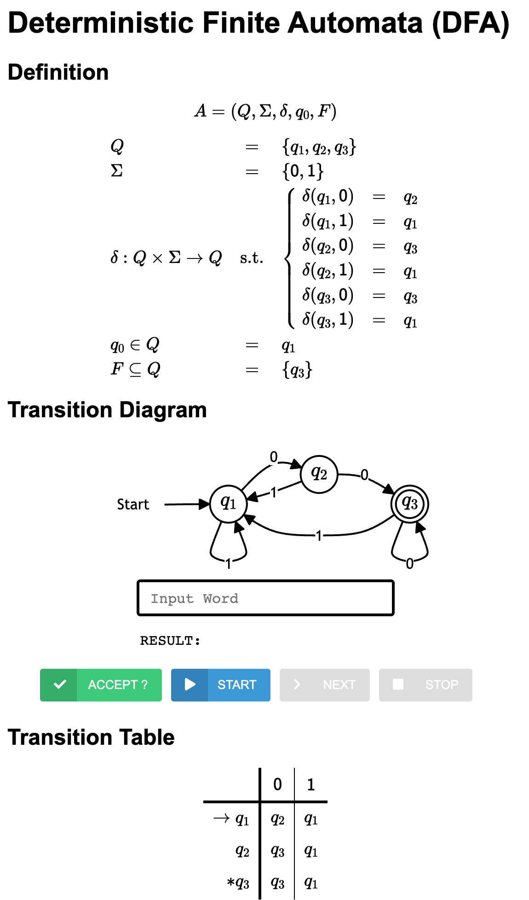

# Equivalence of Regular Expressions and Finite Automata

Please download the template code as follows:
```bash
sbt new ku-plrg-classroom/equiv-re-fa.g8
```

> [!WARNING]
>
> Read the [common instructions](/scala.md) first if you have not read them.

The template source code contains the following files:
<pre><code>equiv-re-fa
├─ viewer
│  ├── index.html ─────────────── The HTML file for the automata viewer
│  ├── js/data.js ─────────────── The data of automata
│  └── ...
└─ src
   ├─ main/scala/kuplrg
   │  ├── FA.scala ────────────── The base class of finite automata (FA)
   │  ├── DFA.scala ───────────── The class of deterministic finite automata (DFA)
   │  ├── NFA.scala ───────────── The class of nondeterministic finite automata (NFA)
   │  ├── ENFA.scala ──────────── The class of ε-nondeterministic finite automata (ε-NFA)
   │  ├── RE.scala ────────────── The class of regular expressions (REs)
   │  ├── Implementation.scala ── <b style='color:red;'>[[ IMPLEMENT AND SUBMIT THIS FILE ]]</b>
   │  ├── Template.scala ──────── The templates of FAs that you must implement
   │  ├── Fuzzer.scala ────────── The fuzzer for random generation of FAs and REs
   │  ├── basics.scala ────────── The definitions of basic functions
   │  └── error.scala ─────────── The definition of the `error` function
   └─ test/scala/kuplrg
      ├─ Spec.scala ───────────── <b style='color:red;'>[[ ADD YOUR OWN TESTS ]]</b>
      └─ SpecBase.scala ───────── The base class of test cases</code></pre>

**The goal of this assignment is to implement the `reToENFA`, `dfaToRE`, and
`enfaToDFA` function in the `Implementation.scala` file.**

- [**(Problem #1) `reToENFA`: Regular Expressions to ε-NFA (30 points)**](#problem-1-retoenfa-regular-expressions-to-ε-nfa-30-points)
- [**(Problem #2) `dfaToRE`: DFA to Regular Expressions (30 points)**](#problem-2-dfatore-dfa-to-regular-expressions-30-points)
- [**(Problem #3) `enfaToDFA`: ε-NFA to DFA (40 points)**](#problem-3-enfatodfa-ε-nfa-to-dfa-40-points)
- [Appendix](#appendix)
  - [Playground](#playground)
  - [Short Definition of FA](#short-definition-of-fa)
  - [String Form of Regular Expressions](#string-form-of-regular-expressions)
  - [Automata Viewer](#automata-viewer)


## (Problem 1) `reToENFA`: Regular Expressions to ε-NFA (30 points)

The first task is to implement the `reToENFA` function that converts a **regular
expression** to an **ε-Non-deterministic Finite Automaton (ε-NFA)**.

We recommend you to utilize the **simplified ε-NFA** (`SFA` class defined in
`Template.scala`).

```scala
/** A simplified epsilon-NFA satisfying the following properties:
  *
  * - States are sequentially numbered from `from` to `to`
  * - The initial state `from` is the initial state
  * - The last state `to` is the final state
  * - No transition to the initial state
  * - No transition from the final state
  *
  * @constructor
  *   create a new simplified epsilon-NFA
  * @param from
  *   the initial state
  * @param edges
  *   the set of edges
  * @param to
  *   the final state
  */
case class SFA(
  from: State,
  edges: Set[SFA.Edge],
  to: State,
):

  /** Convert a simplified epsilon-NFA to an epsilon-NFA */
  def toENFA: ENFA = ENFA(
    states = (from to to).toSet,
    symbols = edges.flatMap(_.symbol).toSet,
    trans = edges
      .groupBy(t => (t.from, t.symbol))
      .map((k, v) => (k, v.map(_.to).toSet))
      .toMap
      .withDefaultValue(Set()),
    initState = from,
    finalStates = Set(to),
  )

object SFA:
  /** A transition edge allowing epsilon-transition
    *
    * @param from
    *   the source state
    * @param symbol
    *   the symbol to be consumed or `None` for epsilon-transition
    * @param to
    *   the target state
    */
  case class Edge(from: State, symbol: Option[Symbol], to: State)
```

If so, the `reToENFA` function is already implemented as follows:

```scala
def reToENFA(re: RE): ENFA = reToSFA(re, 1).toENFA
```

It first 1) converts a regular expression to a simplified ε-NFA (`SFA`) using
`reToSFA` and 2) converts the simplified ε-NFA (`SFA`) to an ε-NFA (`ENFA`)
using the `toENFA` method.

Then, what you have to do is to fill out the remaining parts (`???`) in the body
of the `reToSFA` function that converts a **regular expression** to a
**simplified ε-NFA** with an **initial state**.

```scala
def reToSFA(re: RE, i: State): SFA = ...
```

> [!NOTE]
>
> However, since it is just a recommendation, if you want to implement the
> `reToENFA` function in a different way, you can do so by removing its body and
> implementing it from scratch.

### Test Cases

The test cases are defined in the `Spec.scala` file. You can add your own test
cases in the `Spec.scala` file. The test cases are executed when you run `sbt
test`.

The test cases are defined using the string form of the regular expressions. If
you want to understand the string form, please refer to [String Form of
Regular Expressions](#string-form-of-regular-expressions).

You can see the result of the conversion from a regular expression to an ε-NFA
by using the `dump` method of the `ENFA` class. Please refer to the [Automata
Viewer](#automata-viewer) section for more details.


## (Problem 2) `dfaToRE`: DFA to Regular Expressions (30 points)

The second task is to implement the `dfaToRE` function that converts a
**deterministic finite automaton (DFA)** to a **regular expression**:

We recommend you to utilize the **inductive construction** algorithm to convert
a regular expression from a DFA.

If so, the `dfaToRE` function is already implemented as follows:

```scala
def dfaToRE(dfa: DFA): RE =
  dfa.finalStates
    .map(Implementation.reForPaths(dfa, dfa.initState, _, dfa.states.size))
    .foldLeft(Emp)(Union(_, _))
```

It first 1) constructs a **regular expression representing the set of paths**
from the **initial state** to **each final state** using the `reForPaths`
function and 2) performs the **union** operation for all the regular
expressions.

Then, what you have to do is to fill out the remaining parts (`???`) in the
body of the `reForPaths` function that constructs a **regular expression**
representing the **set of paths** from the given state `i` to the given state
`j` with intermediate states bounded by the given state `k` in the given DFA.

```scala
def reForPaths(dfa: DFA, i: State, j: State, k: State): RE = k match
```

> [!NOTE]
>
> However, since it is just a recommendation, if you want to implement the
> `dfaToRE` function in a different way, you can do so by removing its body and
> implementing it from scratch.

### Test Cases

The test cases are defined in the `Spec.scala` file. You can add your own test
cases in the `Spec.scala` file. The test cases are executed when you run `sbt
test`.

The test cases are defined using the short definition of the DFA. If you want to
understand the short definition, please refer to [Short Definition of
FA](#short-definition-of-fa) section.


## (Problem 3) `enfaToDFA`: ε-NFA to DFA (40 points)

The third task is to implement the `enfaToDFA` function that converts an
**ε-nondeterministic finite automaton (ε-NFA)** to a **deterministic finite
automaton (DFA)**.

We recommend you to utilize the **subset construction** algorithm to convert an
ε-NFA to a DFA. If so, the `enfaToDFA` function is already partially
implemented.

What you have to do is to fill out the missing parts (`???`) in the `enfaToDFA`
function to return the equivalent DFA of the given ε-NFA.

```scala
def enfaToDFA(enfa: ENFA): DFA = ...
```

> [!NOTE]
>
> However, since it is just a recommendation, if you want to implement the
> `enfaToDFA` function in a different way, you can do so by removing its body
> and implementing it from scratch.


### Test Cases

The test cases are defined in the `Spec.scala` file. You can add your own test
cases in the `Spec.scala` file. The test cases are executed when you run `sbt
test`.

The test cases are defined using the short definition of the finite automata. If
you want to understand the short definition, please refer to [Short Definition
of FA](#short-definition-of-fa) section.

You can see the result of the conversion from an ε-NFA to a DFA by using the
`dump` method of the `DFA` class. Please refer to the [Automata
Viewer](#automata-viewer) section for more details.


## Appendix


### Playground

You can run your implementation in the `playground` method in the
`Implementation.scala` file.

```scala
object Implementation extends Template {
  ...
  @main def playground: Unit = {
    ...
    // Do whatever you want here
    // For example, you can print "Hello, World!" as follows:
    println("Hello, World!")
    ...
  }
  ...
}
```
and run the program using `sbt run`:
```bash
$ sbt run
# Hello, World!
```

### Short Definition of FA

You can define a DFA in a short way as follows:
```scala
DFA(3, "ab", "51", "4")
```

It is equivalent to the following definition:

```scala
DFA(
  states = (1 to 3).toSet,
  symbols = "ab".toSet,
  trans = Map(
    (1, 'a') -> 2,
    (1, 'b') -> 1,
    (2, 'a') -> 3,
    (2, 'b') -> 1,
    (3, 'a') -> 3,
    (3, 'b') -> 1
  ),
  initState = 1,
  finalStates = Set(3),
)
```

Each argument of the `DFA` constructor is explained as follows:
- The first argument is **the number of states**
    > For example, `3` means the states are `1`, `2`, and `3`.
- The second argument is **the set of symbols**
    > For example, `"ab"` means the symbols are `'a'` and `'b'`.
- The third argument is **the transition function**
    > For example, the above example has three states and two symbols, so six
    > transitions should be defined. And, the targets of the transitions are:
    > (2, 1, 3, 1, 3, 1). Then, after decreasing each number by 1 and
    > considering the opposite order, we can represent it as `020201` in base 3.
    > Finally, it is equal to the decimal number `181` and equal to `51` in base
    > 36. Therefore, the third argument is `"51"`).
- The fourth argument is **the set of final states**
    > For example, `4` in base 36 is equal to `100` in base 2. In opposite
    > order, it means the final state is the state `3`.

We can define an NFA and an ε-NFA in a similar way. If you want to see the
result of the short form of the automata, you can use the `dump` method of each
automaton (Please refer to the [Automata Viewer](#automata-viewer) section for
more details).

> [!NOTE]
>
> The initial state is always `1`.


### String Form of Regular Expressions

You can define a regular expression in a string form as follows:

```scala
RE("(a|b)*|</>|<e>c")
```

It is equivalent to the following definition:

```scala
import RE.*

Union(
  Union(
    Star(
      Union(
        Sym('a'),
        Sym('b')
      ),
    ),
    Emp,
  ),
  Concat(
    Eps,
    Sym('c'),
  ),
)
```

The string form of the regular expression is defined as follows:
- `</>` represents `Emp`
- `<e>` represents `Eps`
- `a` represents `Sym('a')` (You can use digits or lower case letters as
    symbols: `0` to `9` and `a` to `z`)
- `x|y` represents `Union(x, y)`
- `xy` represents `Concat(x, y)`
- `x*` represents `Star(x)`

You can see the string form of the regular expression using the `dump` method:
```scala
object Implementation extends Template {
  ...
  @main def playground: Unit = {
    ...
    RE("(a|b)*|</>|<e>c").dump
    ...
  }
  ...
}
```
and run the program using `sbt run`:
```bash
$ sbt run
# * A regular expression is dumped:
#   * String form: (a|b)*|</>|<e>c
#   * Scala object: Union(Union(Star(Union(Sym(a),Sym(b))),Emp),Concat(Eps,Sym(c)))
```


### Automata Viewer

> [!NOTE]
>
> You can skip this section if you are not interested in the automata
> viewer. However, it is **HIGHLY RECOMMENDED** to use the automata viewer to
> check your automata when your implementation cannot pass the test cases.

You can **dump your automata** in HTML format to interactively visualize them in
the web browser.

For example, you can dump an automaton `DFA(3, "ab", "51", "4")` to the automata
viewer by invoking its `dump` in the playground:
```scala
object Implementation extends Template {
  ...
  @main def playground: Unit = {
    ...
    DFA(3, "ab", "51", "4").dump
    ...
  }
  ...
}
```
and run the program using `sbt run`:
```bash
$ sbt run
# Dumped the DFA to `viewer/js/data.js`.
# Please open `viewer/index.html` in your browser.
```
Then, the automaton will be dumped to `viewer/js/data.js`, and you can see the
dumped automaton in the automata viewer by opening `viewer/index.html` in your
browser (e.g., Chrome, Edge, Safari, Firefox, etc.):
<p align="center">
  
</p>

Similarly, you can dump and visualize any other automata (including `DFA`,
`NFA`, and `ENFA`) that you implemented to check how they work.

This automata viewer will help you to understand the automata you defined. You
can check whether your automata accept a given word or not by entering the word
in the text box and clicking the `ACCEPT` button (or pressing the `Enter` key).

You can also check each step-by-step transition in the automata by clicking the
`STEP` button after clicking the `START` button. It will highlight the current
possible states. Finally, you can stop the step-by-step execution by clicking
the `STOP` button.
