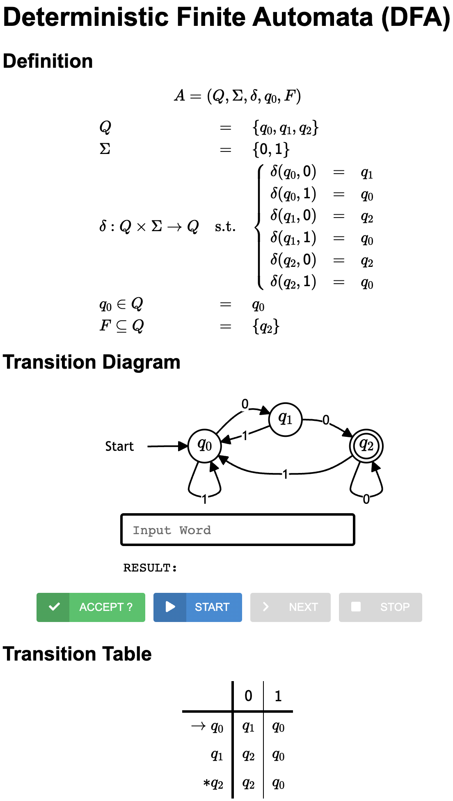

# Finite Automata 예제

[English](./README.md) | [한국어](./README.ko.md)

다음과 같이 `sbt`를 이용하여 템플릿 코드를 다운로드 받으세요:
```bash
sbt new ku-plrg-classroom/fa-examples.g8
```

> :warning: 아직 [공용 지침서](https://github.com/ku-plrg-classroom/docs/blob/main/README.ko.md)를 읽지 않았다면, 이 문서부터 읽어주세요.

템플릿 코드는 다음과 같은 파일들을 포함합니다:
<pre><code>fa-examples
├─ viewer
│  ├── index.html ─────────────── Automata viewer를 위한 HTML 파일
│  ├── js/data.js ─────────────── Automata의 데이터를 저장하는 JavaScript 파일
│  └── ...
└─ src
   ├─ main/scala/kuplrg
   │  ├── FA.scala ────────────── Finite automata (FA)의 공통 기능
   │  ├── DFA.scala ───────────── Deterministic finite automata (DFA)의 정의
   │  ├── NFA.scala ───────────── Nondeterministic finite automata (NFA)의 정의
   │  ├── ENFA.scala ──────────── ε-Non-deterministic finite automata (ε-NFA)의 정의
   │  ├── Implementation.scala ── <b style='color:red;'>[[ 이 파일을 수정하고 제출하세요. ]]</b>
   │  ├── Template.scala ──────── 구현해야 할 함수들의 템플릿
   │  ├── basics.scala ────────── 기본 함수들의 정의
   │  └── error.scala ─────────── `error` 함수의 정의
   └─ test/scala/kuplrg
      ├─ Spec.scala ───────────── <b style='color:red;'>[[ 이 파일에 테스트 케이스를 추가하세요. ]]</b>
      └─ SpecBase.scala ───────── 테스트 케이스의 공통 기능</code></pre>

**이 숙제의 목표는 `Implementation.scala` 파일에 FA 객체들을 구현하는
것입니다.**

- [Automata Viewer](#automata-viewer)
- [Deterministic Finite Automata (40 points)](#deterministic-finite-automata-40-points)
  - [(문제 #1) `dfa_a_star_b` (10 points)](#문제-1-dfa_a_star_b-10-points)
  - [(문제 #2) `dfa_div_3` (10 points)](#문제-2-dfa_div_3-10-points)
  - [(문제 #3) `dfa_subseq_011` (10 points)](#문제-3-dfa_subseq_011-10-points)
  - [(문제 #4) `dfa_even_0_1` (10 points)](#문제-4-dfa_even_0_1-10-points)
- [Nondeterministic Finite Automata (NFA) (30 points)](#nondeterministic-finite-automata-nfa-30-points)
  - [(문제 #5) `nfa_least_two_0` (10 points)](#문제-5-nfa_least_two_0-10-points)
  - [(문제 #6) `nfa_two_0` (10 points)](#문제-6-nfa_two_0-10-points)
  - [(문제 #7) `nfa_substr_000` (10 points)](#문제-7-nfa_substr_000-10-points)
- [ε-Nondeterministic Finite Automata (ε-NFA) (30 points)](#ε-nondeterministic-finite-automata-ε-nfa-30-points)
  - [(문제 #8) `enfa_ab_plus` (10 points)](#문제-8-enfa_ab_plus-10-points)
  - [(문제 #9) `enfa_same_digits` (10 points)](#문제-9-enfa_same_digits-10-points)
  - [(문제 #10) `enfa_aibjck` (10 points)](#문제-10-enfa_aibjck-10-points)

## Automata Viewer

> :warning: 만약에 automata viewer를 사용하지 않고 싶다면, 이 설명을 건너뛰어도
> 됩니다. 하지만, automata viewer를 사용하면 FA 객체들을 시각적으로 확인할 수
> 있고, 구현체가 왜 각 테스트 케이스를 통과하지 못하는지 확인할 수 있습니다.
> 따라서, automata viewer를 사용하는 것을 **매우 권장**합니다.

각각의 FA 객체는 `Implementation.scala` 파일에서 `dumpTarget: FA` 변수에
할당하는 방식으로 automata viewer에 출력할 수 있습니다.

예를 들어, DFA `dfa_w00`의 언어는 다음과 같습니다:

$${\large
L = \lbrace w\texttt{00} \mid w \in \lbrace \texttt{0}, \texttt{1} \rbrace^* \rbrace
}$$

DFA `dfa_w00`의 올바른 구현은 이미 `Implementation.scala` 파일에서 제공하고
있습니다. 만약 `dfa_w00`를 다음과 같이 `dumpTarget`에 할당한다면:
```scala
package kuplrg

object Implementation extends Template {

  // Assign any automaton you want to dump into the automata viewer
  def dumpTarget: FA = dfa_w00

  def dfa_w00: DFA = DFA(
    states = Set(0, 1, 2),
    symbols = Set('0', '1'),
    trans = Map(
      (0, '0') -> 1,
      (0, '1') -> 0,
      (1, '0') -> 2,
      (1, '1') -> 0,
      (2, '0') -> 2,
      (2, '1') -> 0,
    ),
    initState = 0,
    finalStates = Set(2),
  )

  ...
}
```
`sbt test`의 실행을 통해 이 FA 객체를 `viewer/js/data.js` 파일에 출력할 수
있습니다:
```bash
$ sbt
...
sbt:fa-examples> test
...
[test] dumpTarget.dump - PASS
...
```
그 후에, `viewer/index.html` 파일을 브라우저 (예를 들어, Chrome, Safari,
Firefox 등)에서 열어서 출력된 FA 객체를 확인할 수 있습니다:
<p align="center">
  
</p>

이 automata viewer는 정의한 오토마트를 시각적으로 확인할 수 있도록 도와줍니다.
텍스트 박스에 단어를 입력하고 `ACCEPT` 버튼 (또는 `Enter` 키)을 누르면, 그
단어가 오토마트에 의해 수락되는지 여부를 확인할 수 있습니다.

또한, `START` 버튼을 클릭한 후 `STEP` 버튼을 클릭하면, 오토마트의 각 단계별
상태를 확인할 수 있습니다. 마지막으로, `STOP` 버튼을 클릭하면, 단계별 실행을
중단할 수 있습니다.


## Deterministic Finite Automata (40 points)

### (문제 #1) `dfa_a_star_b` (10 points)

DFA `dfa_a_star_b`로 정의된 언어는 다음과 같아야 합니다:

$${\large
L = \lbrace \texttt{a}^n \texttt{b} \mid n \geq 0 \rbrace
}$$

예를 들어, $\texttt{b}$, $\texttt{ab}$, $\texttt{aab}$, $\texttt{aaab}$, $\texttt{aaaaab}$ 등은 이 언어에 속해야 하지만, $\texttt{a}$, $\texttt{ba}$, $\texttt{bb}$, $\texttt{aaa}$, $\texttt{abab}$ 등은 이 언어에 속해서는 안됩니다.


### (문제 #2) `dfa_div_3` (10 points)

DFA `dfa_div_3`로 정의된 언어는 다음과 같아야 합니다:

$${\large
L = \lbrace w \in \lbrace \texttt{0}, \texttt{1}^* \rbrace \mid \mathbb{N}(w) \equiv 0 (\text{mod } 3) \rbrace
}$$

여기서, $\mathbb{N}(w)$는 $w$를 이진수로 해석한 자연수를 의미합니다. 예를 들어, $\mathbb{N}(\texttt{101}) = 4 + 1 = 5$이고, $\mathbb{N}(\texttt{1111}) = 8 + 4 + 2 + 1 = 15$입니다. 또한, 이 언어는 앞에 붙은 0을 허용하기 때문에, $\mathbb{N}(\texttt{00101}) = 4 + 1 = 5$입니다. 따라서, $\texttt{11}$, $\texttt{1111}$, $\texttt{00110}$ 등은 이 언어에 속해야 하지만, $\texttt{1}$, $\texttt{010}$, $\texttt{100}$, $\texttt{1110}$ 등은 이 언어에 속해서는 안됩니다.

### (문제 #3) `dfa_subseq_011` (10 points)

DFA `dfa_subseq_011`로 정의된 언어는 다음과 같아야 합니다:

$${\large
L = \lbrace w \in \lbrace \texttt{0}, \texttt{1} \rbrace^* \mid \texttt{011} \text{ is a subsequence of } w \rbrace
}$$

> :warning: 이 정의에서, SUBSEQUENCE는 SUBSTRING과는 다르게 연속적이지 않아도 됩니다. 예를 들어, $\texttt{011}$은 $\texttt{10101}$의 subsequence입니다. 왜냐하면, $\texttt{10101}$의 두 번째 ($\texttt{0}$), 세 번째 ($\texttt{1}$), 그리고 다섯 번째 ($\texttt{1}$) 문자를 합치면, $\texttt{011}$이기 때문입니다.

예를 들어, $\texttt{011}$, $\texttt{10101}$, $\texttt{101011}$, $\texttt{10101011}$등은 이 언어에 속해야 하지만, $\texttt{0}$, $\texttt{1}$, $\texttt{10}$, $\texttt{100}$, $\texttt{101}$, $\texttt{110}$, $\texttt{111}$, 등은 이 언어에 속해서는 안됩니다.

### (문제 #4) `dfa_even_0_1` (10 points)

DFA `dfa_even_0_1`로 정의된 언어는 다음과 같아야 합니다:

$${\large
L = \lbrace w \in \lbrace \texttt{0}, \texttt{1} \rbrace^* \mid \textsf{zeros}(w) \equiv 0 (\text{mod } 2) \wedge \textsf{ones}(w) \equiv 0 (\text{mod } 2) \rbrace
}$$

여기서, $\textsf{zeros}(w)$와 $\textsf{ones}(w)$는 $w$에 등장하는 $\texttt{0}$과 $\texttt{1}$의 개수를 의미합니다. 예를 들어, $\textsf{zeros}(\texttt{10101}) = 2$이고, $\textsf{ones}(\texttt{10101}) = 3$입니다. 따라서, $\texttt{00}$, $\texttt{11}$, $\texttt{0000}$, $\texttt{1001}$, $\texttt{100100}$ 등은 이 언어에 속해야 하지만, $\texttt{0}$, $\texttt{1}$, $\texttt{10}$, $\texttt{01}$, $\texttt{101}$, $\texttt{110}$, $\texttt{111}$, $\texttt{100}$, $\texttt{001}$ 등은 이 언어에 속해서는 안됩니다.


## Nondeterministic Finite Automata (NFA) (30 points)

### (문제 #5) `nfa_least_two_0` (10 points)

NFA `nfa_least_two_0`로 정의된 언어는 다음과 같아야 합니다:

$${\large
L = \lbrace w \in \lbrace \texttt{0}, \texttt{1} \rbrace^* \mid w \text{ contains at least two } \texttt{0} \text{'s} \rbrace
}$$

에를 들어, $\texttt{00}$, $\texttt{010}$, $\texttt{000}$, $\texttt{010100}$ 등은 이 언어에 속해야 하지만, $\texttt{0}$, $\texttt{01}$, $\texttt{10}$, $\texttt{11}$, $\texttt{11011}$ 등은 이 언어에 속해서는 안됩니다.

### (문제 #6) `nfa_two_0` (10 points)

NFA `nfa_two_0`로 정의된 언어는 다음과 같아야 합니다:

$${\large
L = \lbrace w \in \lbrace \texttt{0}, \texttt{1} \rbrace^* \mid w \text{ contains exactly two } \texttt{0} \text{'s} \rbrace
}$$


예를 들어, $\texttt{00}$, $\texttt{001}$, $\texttt{010}$, $\texttt{100}$, $\texttt{01110}$, $\texttt{110111101}$ 등은 이 언어에 속해야 하지만, $\epsilon$, $\texttt{01}$, $\texttt{10}$, $\texttt{11}$, $\texttt{000}$, $\texttt{0010}$, $\texttt{0100}$, $\texttt{1000}$, $\texttt{01010110}$ 등은 이 언어에 속해서는 안됩니다.

### (문제 #7) `nfa_substr_000` (10 points)

NFA `nfa_substr_000`로 정의된 언어는 다음과 같아야 합니다:

$${\large
L = \lbrace w \in \lbrace \texttt{0}, \texttt{1} \rbrace^* \mid \texttt{000} \text{ is a substring of } w \rbrace
}$$

예를 들어, $\texttt{000}$, $\texttt{1000}$, $\texttt{01000}$ 등은 이 언어에 속해야 하지만, $\texttt{0100}$, $\texttt{001}$, $\texttt{01010}$ 등은 이 언어에 속해서는 안됩니다.

## ε-Nondeterministic Finite Automata (ε-NFA) (30 points)

### (문제 #8) `enfa_ab_plus` (10 points)

ε-NFA `enfa_ab_plus`로 정의된 언어는 다음과 같아야 합니다:

$${\large
L = \lbrace (\texttt{ab})^n \mid n \geq 0 \rbrace
}$$

예를 들어, $\epsilon$, $\texttt{ab}$, $\texttt{abab}$, $\texttt{ababab}$ 등은 이 언어에 속해야 하지만, $\texttt{a}$, $\texttt{b}$, $\texttt{abba}$ 등은 이 언어에 속해서는 안됩니다.

### (문제 #9) `enfa_same_digits` (10 points)

ε-NFA `enfa_same_digits`로 정의된 언어는 다음과 같아야 합니다:

$${\large
L = \lbrace \texttt{0}^n \mid n \geq 0 \rbrace \cup \lbrace \texttt{1}^n \mid n \geq 0 \rbrace
}$$

예를 들어, $\epsilon$, $\texttt{0}$, $\texttt{1}$, $\texttt{000}$, $\texttt{11111}$ 등은 이 언어에 속해야 하지만, $\texttt{01}$, $\texttt{10}$, $\texttt{011}$ 등은 이 언어에 속해서는 안됩니다.

### (문제 #10) `enfa_aibjck` (10 points)

ε-NFA `enfa_aibjck`로 정의된 언어는 다음과 같아야 합니다:

$${\large
L = \lbrace \texttt{a}^i \texttt{b}^j \texttt{c}^k \mid i, j, k \geq 0 \rbrace
}$$

예를 들어, $\epsilon$, $\texttt{a}$, $\texttt{ac}$, $\texttt{bc}$, $\texttt{aaa}$, $\texttt{aabc}$, $\texttt{bbcc}$, $\texttt{aacc}$ 등은 이 언어에 속해야 하지만, $\texttt{ba}$, $\texttt{bca}$, $\texttt{ccb}$, $\texttt{ca}$, $\texttt{aba}$, $\texttt{abab}$ 등은 이 언어에 속해서는 안됩니다.
