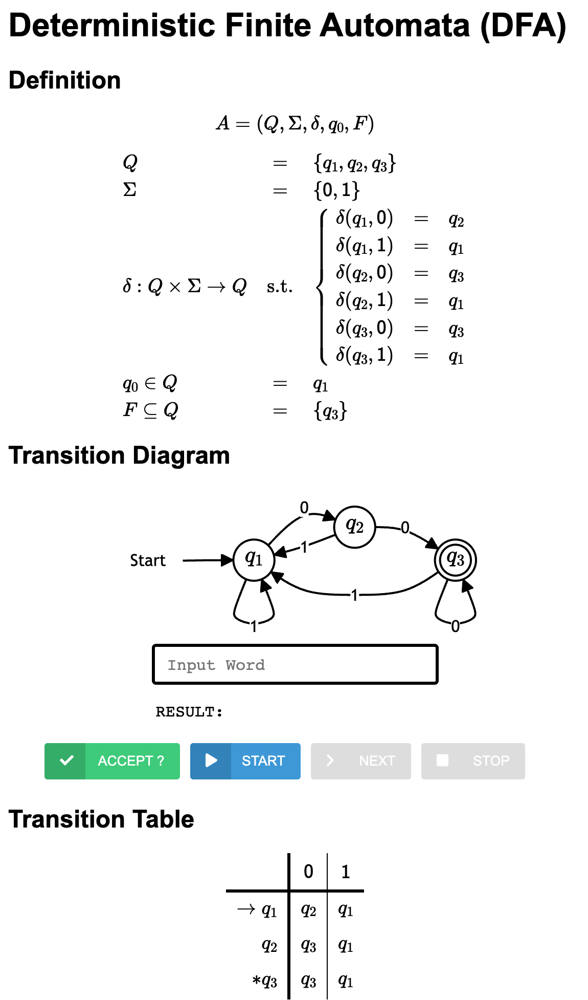

# Examples of Finite Automata

Please download the template code as follows:
```bash
sbt new ku-plrg-classroom/fa-examples.g8
```

> [!WARNING]
>
> Read the [common instructions](/scala.md) first if you have not read them.

The template source code contains the following files:
<pre><code>fa-examples
├─ viewer
│  ├── index.html ─────────────── The HTML file for the automata viewer
│  ├── js/data.js ─────────────── The data of automata
│  └── ...
└─ src
   ├─ main/scala/kuplrg
   │  ├── FA.scala ────────────── The base class of finite automata (FA)
   │  ├── DFA.scala ───────────── The class of deterministic finite automata (DFA)
   │  ├── NFA.scala ───────────── The class of nondeterministic finite automata (NFA)
   │  ├── ENFA.scala ──────────── The class of ε-nondeterministic finite automata (ε-NFA)
   │  ├── Implementation.scala ── <b style='color:red;'>[[ IMPLEMENT AND SUBMIT THIS FILE ]]</b>
   │  ├── Template.scala ──────── The templates of FAs that you must implement
   │  ├── basics.scala ────────── The definitions of basic functions
   │  └── error.scala ─────────── The definition of the `error` function
   └─ test/scala/kuplrg
      ├─ Spec.scala ───────────── <b style='color:red;'>[[ ADD YOUR OWN TESTS ]]</b>
      └─ SpecBase.scala ───────── The base class of test cases</code></pre>

**The goal of this assignment is to implement the finite automata (FA) objects in
the `Implementation.scala` file.**

- [**Deterministic Finite Automata (DFA) (40 points)**](#deterministic-finite-automata-dfa-40-points)
  - [(Problem #1) `dfa_len_div_3` (10 points)](#problem-1-dfa_len_div_3-10-points)
  - [(Problem #2) `dfa_same_start_end` (10 points)](#problem-2-dfa_same_start_end-10-points)
  - [(Problem #3) `dfa_not_substr_101` (10 points)](#problem-3-dfa_not_substr_101-10-points)
  - [(Problem #4) `dfa_div_4_1` (10 points)](#problem-4-dfa_div_4_1-10-points)
- [**Nondeterministic Finite Automata (NFA) (30 points)**](#nondeterministic-finite-automata-nfa-30-points)
  - [(Problem #5) `nfa_comb_aaa_bb` (10 points)](#problem-5-nfa_comb_aaa_bb-10-points)
  - [(Problem #6) `nfa_101_or_110` (10 points)](#problem-6-nfa_101_or_110-10-points)
  - [(Problem #7) `nfa_has_aa_or_bb` (10 points)](#problem-7-nfa_has_aa_or_bb-10-points)
- [**ε-Nondeterministic Finite Automata (ε-NFA) (30 points)**](#ε-nondeterministic-finite-automata-ε-nfa-30-points)
  - [(Problem #8) `enfa_opt_pre_post` (10 points)](#problem-8-enfa_opt_pre_post-10-points)
  - [(Problem #9) `enfa_some_plus` (10 points)](#problem-9-enfa_some_plus-10-points)
  - [(Problem #10) `enfa_complex` (10 points)](#problem-10-enfa_complex-10-points)
- [Appendix](#appendix)
  - [Playground](#playground)
  - [Automata Viewer](#automata-viewer)


## Deterministic Finite Automata (DFA) (40 points)

A **deterministic finite automaton (DFA)** is defined as the following `case
class`:
```scala
case class DFA(
  states: Set[State],
  symbols: Set[Symbol],
  trans: Map[(State, Symbol), State],
  initState: State,
  finalStates: Set[State],
) extends FA
```

For instance, you can define a DFA `dfa_waa` as follows:
```scala
def dfa_waa: DFA = DFA(
  states      = Set(0, 1, 2),
  symbols     = Set('a', 'b'),
  initState   = 0,
  finalStates = Set(2),
)(
  (0, 'a') -> 1,
  (0, 'b') -> 0,
  (1, 'a') -> 2,
  (1, 'b') -> 0,
  (2, 'a') -> 2,
  (2, 'b') -> 0,
)
```
whose language is:
$${\large
L = \lbrace w \texttt{aa} \mid w \in \lbrace \texttt{a}, \texttt{b} \rbrace^* \rbrace
}$$

In this part, you need to implement the `DFA` instances whose languages are
equal to the given languages.


### (Problem #1) `dfa_len_div_3` (10 points)

Please implement the DFA `dfa_len_div_3` whose language represents words whose
length is divisible by 3 over the alphabet $\lbrace \texttt{a}, \texttt{b}
\rbrace$:

$${\large
L = \lbrace w \in \lbrace \texttt{a}, \texttt{b} \rbrace^* \mid |w| \equiv 0 \pmod 3 \rbrace
}$$

- **Accepted:** $\epsilon$, `aaa`, `aba`, `bbabab`
- **Rejected:** `a`, `ab`, `aaaa`


### (Problem #2) `dfa_same_start_end` (10 points)

Please implement the DFA `dfa_same_start_end` whose language represents words
that start and end with the same symbol over the alphabet $\lbrace \texttt{a},
\texttt{b} \rbrace$:

$${\large
L = \lbrace w \in \lbrace \texttt{a}, \texttt{b} \rbrace^+ \mid \text{first}(w) = \text{last}(w) \rbrace
}$$

- **Accepted:** `a`, `b`, `aba`, `baab`, `abbaa`
- **Rejected:** $\epsilon$, `ab`, `ba`, `abab`


### (Problem #3) `dfa_not_substr_101` (10 points)

Please implement the DFA `dfa_not_substr_101` whose language represents words
that do not contain `101` as a substring over the alphabet $\lbrace \texttt{0},
\texttt{1} \rbrace$:

$${\large
L = \lbrace w \in \lbrace \texttt{0}, \texttt{1} \rbrace^* \mid \texttt{101} \text{ is not a substring of } w \rbrace
}$$

- **Accepted:** $\epsilon$, `000`, `111`, `1100`, `1001`
- **Rejected:** `101`, `0101`, `11010`

> [!WARNING]
>
> Note that the **SUBSTRING** is a contiguous sequence of characters within a
> string.


### (Problem #4) `dfa_div_4_1` (10 points)

Please implement the DFA `dfa_div_4_1` whose language represents words that
represent natural numbers that are congruent to 1 modulo 4 over the alphabet
$\lbrace \texttt{1}, \texttt{2}, \texttt{3} \rbrace$:

$${\large
L = \lbrace w \in \lbrace \texttt{1}, \texttt{2}, \texttt{3} \rbrace^+ \mid \mathbb{N}_10(w) \equiv 1 \pmod 4 \rbrace
}$$

where $\mathbb{N}_10(w)$ is the natural number represented by $w$ in base 10.

- **Accepted:** `1`, `13`, `21`, `33`, `121`
- **Rejected:** $\epsilon$, `2`, `3`, `11`, `12`, `22`


## Nondeterministic Finite Automata (NFA) (30 points)

A **nondeterministic finite automaton (NFA)** is defined as the following `case
class`:
```scala
case class NFA(
  states: Set[State],
  symbols: Set[Symbol],
  trans: Map[(State, Symbol), Set[State]],
  initState: State,
  finalStates: Set[State],
) extends FA
```

For instance, you can define a NFA `nfa_least_two_0` as follows:
```scala
def nfa_least_two_0: NFA = NFA(
  states = Set(0, 1, 2),
  symbols = Set('0', '1'),
  initState = 0,
  finalStates = Set(2),
)(
  (0, '0') -> 0,
  (0, '0') -> 1,
  (0, '1') -> 0,
  (1, '0') -> 1,
  (1, '0') -> 2,
  (1, '1') -> 1,
  (2, '0') -> 2,
  (2, '1') -> 2,
)
```
whose language is:
$${\large
L = \lbrace w \in \lbrace \texttt{0}, \texttt{1} \rbrace^* \mid w \text{ contains at least two } \texttt{0} \text{'s} \rbrace
}$$

> [!NOTE]
>
> In an NFA, there can be multiple transitions for the same state and symbol.
> For example, in the above NFA `nfa_least_two_0`, there are two transitions
> from state 0 on symbol `0`: one goes to state 0 and the other goes to state 1.

In this part, you need to implement the `NFA` instances whose languages are
equal to the given languages.


### (Problem #5) `nfa_comb_aaa_bb` (10 points)

Please implement the NFA `nfa_comb_aaa_bb` whose language represents words that
are concatenations of `aaa` and `bb` over the alphabet $\lbrace \texttt{a},
\texttt{b} \rbrace$, and you must implement it using **5 or fewer transitions**:

$${\large
L = \lbrace \texttt{aaa}, \texttt{bb} \rbrace^*
}$$

- **Accepted:** $\epsilon$, `aaa`, `bb`, `aaabb`, `bbaaa`, `bbbb`
- **Rejected:** `a`, `aa`, `b`, `aaab`, `baaa`


### (Problem #6) `nfa_101_or_110` (10 points)

Please implement the NFA `nfa_101_or_110` whose language represents words that
end with `101` or `110` over the alphabet $\lbrace \texttt{0}, \texttt{1}
\rbrace$, and you must implement it using **7 or fewer transitions**:

$${\large
L = \lbrace w \in \lbrace \texttt{0}, \texttt{1} \rbrace^* \mid w \text{ ends with } \texttt{101} \text{ or } \texttt{110} \rbrace
}$$

- **Accepted:** `101`, `110`, `0101`, `11110`, `000110`, `101110`, `110101`
- **Rejected:** $\epsilon$, `10`, `11`, `1011`, `1100`, `1010`, `1101`


### (Problem #7) `nfa_has_aa_or_bb` (10 points)

Please implement the NFA `nfa_has_aa_or_bb` whose language represents words that
contain `aa` or `bb` as a substring over the alphabet $\lbrace \texttt{a},
\texttt{b} \rbrace$, and you must implement it using **8 or fewer transitions**:

$${\large
L = \lbrace w \in \lbrace \texttt{a}, \texttt{b} \rbrace^* \mid w \text{ contains } \texttt{aa} \text{ or } \texttt{bb} \text{ as a substring} \rbrace
}$$

- **Accepted:** `aa`, `bb`, `abaa`, `bababbb`
- **Rejected:** $\epsilon$, `a`, `b`, `ab`, `aba`, `bab`

> [!WARNING]
>
> Note that the **SUBSTRING** is a contiguous sequence of characters within a
> string.


## ε-Nondeterministic Finite Automata (ε-NFA) (30 points)

An **ε-nondeterministic finite automaton (ε-NFA)** is defined as the following
`case class`:
```scala
case class ENFA(
  states: Set[State],
  symbols: Set[Symbol],
  trans: Map[(State, Option[Symbol]), Set[State]],
  initState: State,
  finalStates: Set[State],
) extends FA
```

For instance, you can define a ε-NFA `enfa_ai_bj_ck` as follows:
```scala
def enfa_ai_bj_ck: ENFA = ENFA(
  states = Set(0, 1, 2),
  symbols = Set('a', 'b', 'c'),
  initState = 0,
  finalStates = Set(2),
)(
  (0, EPS) -> 1,
  (0, 'a') -> 0,
  (1, EPS) -> 2,
  (1, 'b') -> 1,
  (2, 'c') -> 2,
)
```
whose language is:
$${\large
L = \lbrace \texttt{a}^i \texttt{b}^j \texttt{c}^k \mid i, j, k \geq 0 \rbrace
}$$

> [!NOTE]
>
> The `EPS` symbol represents the ε-transition.

In this part, you need to implement the `ENFA` instances whose languages are
equal to the given languages.


### (Problem #8) `enfa_opt_pre_post` (10 points)

Please implement the ε-NFA `enfa_opt_pre_post` whose language represents words
that optionally start with `aa` and/or end with `bb` over the alphabet $\lbrace
\texttt{a}, \texttt{b}, \texttt{c} \rbrace$, and you must implement it using **7
or fewer transitions**:

$${\large
L = \lbrace \epsilon, \texttt{aa} \rbrace \lbrace \texttt{c}^n \mid n \geq 0 \rbrace \lbrace \epsilon, \texttt{bb} \rbrace
}$$

- **Accepted:** $\epsilon$, `aa`, `bb`, `c`, `aac`, `cbb`, `aacbb`, `ccbb`,
  `aacccc`, `ccccbb`
- **Rejected:** `a`, `b`, `ac`, `cb`, `aab`, `abb`, `aaca`, `ccbbcc`


### (Problem #9) `enfa_some_plus` (10 points)

Please implement the ε-NFA `enfa_some_plus` whose language represents words that
are concatenations of `aca`, `acb`, `bca`, and `bcb` over the alphabet $\lbrace
\texttt{a}, \texttt{b}, \texttt{c} \rbrace$, and you must implement it using **6
or fewer transitions**:

$${\large
L = \lbrace \texttt{aca}, \texttt{acb}, \texttt{bca}, \texttt{bcb} \rbrace^+
}$$

- **Accepted:** `aca`, `bcb`, `acabca`, `bcbacb`
- **Rejected:** $\epsilon$, `ac`, `bc`, `acac`, `acbcb`, `bcbca`, `acbabc`


### (Problem #10) `enfa_complex` (10 points)

Please implement the ε-NFA `enfa_complex` whose language represents words that
represent natural numbers that are congruent to 1 modulo 3 or contain a number
of `0`'s that is congruent to 1 modulo 3 over the alphabet $\lbrace \texttt{0},
\texttt{1} \rbrace$, and you must implement it using **14 or fewer
transitions**:

$${\large
L = L_1 \cup L_2
}$$
where
$${\large
\begin{array}{l@{}l@{}l}
L_1 &=& \lbrace w \in \lbrace \texttt{0}, \texttt{1} \rbrace^* \mid \mathbb{N}_2(w) \equiv 1 \pmod 3 \rbrace \\
L_2 &=& \lbrace w \in \lbrace \texttt{0}, \texttt{1} \rbrace^* \mid \textsf{zeros}(w) \equiv 1 \pmod 3 \rbrace \\
\end{array}
}$$

where $\mathbb{N}_2(w)$ is the natural number represented by $w$ in binary that
allows leading zeros, and $\mathbb{N}_2(\epsilon) = 0$. Also,
$\textsf{zeros}(w)$ is the number of `0`'s in $w$.

- **Accepted:** `0`, `1`, `01`, `10`, `001`, `1010`, `11100`, `0010110`,
  `1011111`
- **Rejected:** $\epsilon$, `00`, `11`, `000`, `010`, `0010`, `0011`,
  `00011`, `01011`,`100011`


## Appendix


### Playground

You can run your implementation in the `playground` method in the
`Implementation.scala` file.

```scala
object Implementation extends Template {
  ...
  @main def playground: Unit = {
    ...
    // Do whatever you want here
    // For example, you can print "Hello, World!" as follows:
    println("Hello, World!")
    ...
  }
  ...
}
```
and run the program using `sbt run`:
```bash
$ sbt run
# Hello, World!
```


### Automata Viewer

> [!NOTE]
>
> You can skip this section if you are not interested in the automata
> viewer. However, it is **HIGHLY RECOMMENDED** to use the automata viewer to
> check your automata when your implementation cannot pass the test cases.

You can **dump your automata** in HTML format to interactively visualize them in
the web browser.

For example, you can dump the automaton `dfa_waa` to the automata viewer by
invoking the `dump` method of `dfa_waa` in the playground:
```scala
object Implementation extends Template {
  ...
  @main def playground: Unit = {
    ...
    dfa_waa.dump
    ...
  }
  ...
}
```
and run the program using `sbt run`:
```bash
$ sbt run
# Dumped the DFA to `viewer/js/data.js`.
# Please open `viewer/index.html` in your browser.
```
Then, the automaton will be dumped to `viewer/js/data.js`, and you can see the
dumped automaton in the automata viewer by opening `viewer/index.html` in your
browser (e.g., Chrome, Edge, Safari, Firefox, etc.):
<p align="center">
  
</p>

Similarly, you can dump and visualize any other automata (including `DFA`,
`NFA`, and `ENFA`) that you implemented to check how they work.

This automata viewer will help you to understand the automata you defined. You
can check whether your automata accept a given word or not by entering the word
in the text box and clicking the `ACCEPT` button (or pressing the `Enter` key).

You can also check each step-by-step transition in the automata by clicking the
`STEP` button after clicking the `START` button. It will highlight the current
possible states. Finally, you can stop the step-by-step execution by clicking
the `STOP` button.
