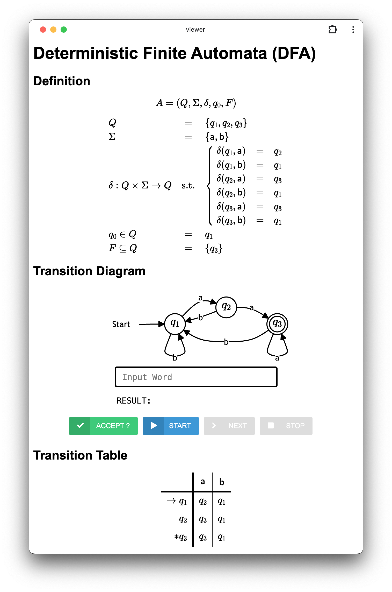

# Closure Properties of Regular Languages

Please download the template code as follows:
```bash
sbt new ku-plrg-classroom/rl-closure.g8
```

> [!WARNING]
>
> Read the [common instructions](https://github.com/ku-plrg-classroom/docs/blob/main/README.md) first if you have not read them.

The template source code contains the following files:
<pre><code>rl-closure
├─ viewer
│  ├── index.html ─────────────── The HTML file for the automata viewer
│  ├── js/data.js ─────────────── The data of automata
│  └── ...
└─ src
   ├─ main/scala/kuplrg
   │  ├── FA.scala ────────────── The base class of finite automata (FA)
   │  ├── DFA.scala ───────────── The class of deterministic finite automata (DFA)
   │  ├── NFA.scala ───────────── The class of nondeterministic finite automata (NFA)
   │  ├── ENFA.scala ──────────── The class of ε-nondeterministic finite automata (ε-NFA)
   │  ├── RE.scala ────────────── The class of regular expressions (REs)
   │  ├── Implementation.scala ── <b style='color:red;'>[[ IMPLEMENT AND SUBMIT THIS FILE ]]</b>
   │  ├── Template.scala ──────── The templates of FAs that you must implement
   │  ├── Fuzzer.scala ────────── The fuzzer for random generation of FAs and REs
   │  ├── basics.scala ────────── The definitions of basic functions
   │  └── error.scala ─────────── The definition of the `error` function
   └─ test/scala/kuplrg
      ├─ Spec.scala ───────────── <b style='color:red;'>[[ ADD YOUR OWN TESTS ]]</b>
      └─ SpecBase.scala ───────── The base class of test cases</code></pre>

**The goal of this assignment is to implement six different functions applying
corresponding operations on finite automata or regular expressions.**

- [**(Problem #1) Complement of DFA (10 points)**](#problem-1-complement-of-dfa-10-points)
- [**(Problem #2) Intersection of DFA (30 points)**](#problem-2-intersection-of-dfa-30-points)
- [**(Problem #3) Reversal of ε-NFA (30 points)**](#problem-3-reversal-of-ε-nfa-30-points)
- [**(Problem #4) Reversal of Regular Expressions (10 points)**](#problem-4-reversal-of-regular-expressions-10-points)
- [**(Problem #5) Homomorphism of Regular Expressions (10 points)**](#problem-5-homomorphism-of-regular-expressions-10-points)
- [**(Problem #6) Inverse Homomorphism of DFA (10 points)**](#problem-6-inverse-homomorphism-of-dfa-10-points)
- [Appendix](#appendix)
  - [Playground](#playground)
  - [Short Definition of FA](#short-definition-of-fa)
  - [String Form of Regular Expressions](#string-form-of-regular-expressions)
  - [Automata Viewer](#automata-viewer)


## (Problem 1) Complement of DFA (10 points)

The first task is to implement the `complementDFA` function that returns the
**complement** of the given **deterministic finite automaton (DFA)**.

```scala
def complementDFA(dfa: DFA): DFA = ???
```


## (Problem 2) Intersection of DFA (30 points)

The second task is to implement the `intersectDFA` function that returns the
**intersection** of the given **deterministic finite automata (DFA)**.

```scala
def intersectDFA(ldfa: DFA, rdfa: DFA): DFA = ???
```


## (Problem 3) Reversal of ε-NFA (30 points)

The third task is to implement the `reverseENFA` function that returns the
**reversal** of the given **ε-nondeterministic finite automaton (ε-NFA)**.

```scala
def reverseENFA(enfa: ENFA): ENFA = ???
```


## (Problem 4) Reversal of Regular Expressions (10 points)

The fourth task is to implement the `reverseRE` function that returns the
**reversal** of the given **regular expression**.

```scala
def reverseRE(re: RE): RE = ???
```


## (Problem 5) Homomorphism of Regular Expressions (10 points)

The fifth task is to implement the `homRE` function that returns the
**homomorphism** of the given **regular expression**.

```scala
def homRE(re: RE, h: Hom): RE = ???
```

where the `Hom` type is defined as a mapping from symbols to words in the `basics.scala` file as follows:
```scala
type Hom = Map[Symbol, Word]
```

## (Problem 6) Inverse Homomorphism of DFA (10 points)

The sixth task is to implement the `ihomDFA` function that returns the **inverse
homomorphism** of the given **deterministic finite automaton (DFA)**.

```scala
def homRE(re: RE, h: Hom): RE = ???
```

where the `Hom` type is defined as a mapping from symbols to words in the `basics.scala` file as follows:
```scala
type Hom = Map[Symbol, Word]
```


## Appendix


### Playground

You can run your implementation in the `playground` method in the
`Implementation.scala` file.

```scala
object Implementation extends Template {
  ...
  @main def playground: Unit = {
    ...
    // Do whatever you want here
    // For example, you can print "Hello, World!" as follows:
    println("Hello, World!")
    ...
  }
  ...
}
```
and run the program using `sbt run`:
```bash
$ sbt run
# Hello, World!
```

### Short Definition of FA

You can define a DFA in a short way as follows:
```scala
DFA(3, "ab", "51", "4")
```

It is equivalent to the following definition:

```scala
DFA(
  states = (1 to 3).toSet,
  symbols = "ab".toSet,
  trans = Map(
    (1, 'a') -> 2,
    (1, 'b') -> 1,
    (2, 'a') -> 3,
    (2, 'b') -> 1,
    (3, 'a') -> 3,
    (3, 'b') -> 1
  ),
  initState = 1,
  finalStates = Set(3),
)
```

Each argument of the `DFA` constructor is explained as follows:
- The first argument is **the number of states**
    > For example, `3` means the states are `1`, `2`, and `3`.
- The second argument is **the set of symbols**
    > For example, `"ab"` means the symbols are `'a'` and `'b'`.
- The third argument is **the transition function**
    > For example, the above example has three states and two symbols, so six
    > transitions should be defined. And, the targets of the transitions are:
    > (2, 1, 3, 1, 3, 1). Then, after decreasing each number by 1 and
    > considering the opposite order, we can represent it as `020201` in base 3.
    > Finally, it is equal to the decimal number `181` and equal to `51` in base
    > 36. Therefore, the third argument is `"51"`).
- The fourth argument is **the set of final states**
    > For example, `4` in base 36 is equal to `100` in base 2. In opposite
    > order, it means the final state is the state `3`.

We can define an NFA and an ε-NFA in a similar way, If you want to see the
result of the short form of the automata, you can use the `dump` method of each
automaton (Please refer to the [Automata Viewer](#automata-viewer) section for
more details).

> [!NOTE]
>
> The initial state is always `1`.


### String Form of Regular Expressions

You can define a regular expression in a string form as follows:

```scala
RE("(a|b)*|</>|<e>c")
```

It is equivalent to the following definition:

```scala
import RE.*

Union(
  Union(
    Star(
      Union(
        Sym('a'),
        Sym('b')
      ),
    ),
    Emp,
  ),
  Concat(
    Eps,
    Sym('c'),
  ),
)
```

The string form of the regular expression is defined as follows:
- `</>` represents `Emp`
- `<e>` represents `Eps`
- `a` represents `Sym('a')` (You can use digits or lower case letters as
    symbols: `0` to `9` and `a` to `z`)
- `x|y` represents `Union(x, y)`
- `xy` represents `Concat(x, y)`
- `x*` represents `Star(x)`

You can see the string form of the regular expression using the `dump` method:
```scala
object Implementation extends Template {
  ...
  @main def playground: Unit = {
    ...
    RE("(a|b)*|</>|<e>c").dump
    ...
  }
  ...
}
```
and run the program using `sbt run`:
```bash
$ sbt run
# * A regular expression is dumped:
#   * String form: (a|b)*|</>|<e>c
#   * Scala object: Union(Union(Star(Union(Sym(a),Sym(b))),Emp),Concat(Eps,Sym(c)))
```


### Automata Viewer

> [!NOTE]
>
> You can skip this section if you are not interested in the automata
> viewer. However, it is **HIGHLY RECOMMENDED** to use the automata viewer to
> check your automata when your implementation cannot pass the test cases.

You can **dump your automata** in HTML format to interactively visualize them in
the web browser.

For example, you can dump an automaton `DFA(3, "ab", "51", "4")` to the automata
viewer by invoking its `dump` in the playground:
```scala
object Implementation extends Template {
  ...
  @main def playground: Unit = {
    ...
    DFA(3, "ab", "51", "4").dump
    ...
  }
  ...
}
```
and run the program using `sbt run`:
```bash
$ sbt run
# Dumped the DFA to `viewer/js/data.js`.
# Please open `viewer/index.html` in your browser.
```
Then, the automaton will be dumped to `viewer/js/data.js`, and you can see the
dumped automaton in the automata viewer by opening `viewer/index.html` in your
browser (e.g., Chrome, Edge, Safari, Firefox, etc.):
<p align="center">
  
</p>

Similarly, you can dump and visualize any other automata (including `DFA`,
`NFA`, and `ENFA`) that you implemented to check how they work.

This automata viewer will help you to understand the automata you defined. You
can check whether your automata accept a given word or not by entering the word
in the text box and clicking the `ACCEPT` button (or pressing the `Enter` key).

You can also check each step-by-step transition in the automata by clicking the
`STEP` button after clicking the `START` button. It will highlight the current
possible states. Finally, you can stop the step-by-step execution by clicking
the `STOP` button.
