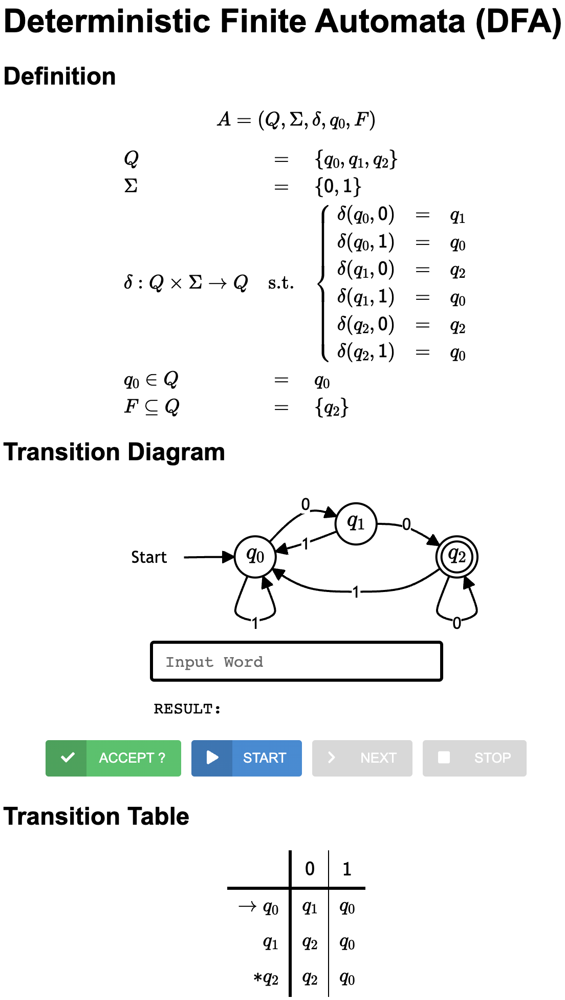

# Finite Automata Examples

[English](./README.md) | [한국어](./README.ko.md)

Please download the template code as follows:
```bash
sbt new ku-plrg-classroom/fa-examples.g8
```

> :warning: Read the [common instructions](https://github.com/ku-plrg-classroom/docs/blob/main/README.md) first if you have not read them.

The template source code contains the following files:
```
fa-examples
├─ viewer
│  ├── index.html ────────────── The HTML file for the automata viewer
│  ├── js/data.js ────────────── The data of automata
│  └── ...
└─ src
   ├─ main/scala/kuplrg
   │  ├── FA.scala ────────────── The base class of finite automata (FA)
   │  ├── DFA.scala ───────────── The class of deterministic finite automata (DFA)
   │  ├── NFA.scala ───────────── The class of nondeterministic finite automata (NFA)
   │  ├── ENFA.scala ──────────── The class of ε-nondeterministic finite automata (ε-NFA)
   │  ├── Implementation.scala ── [[ IMPLEMENT AND SUBMIT THIS FILE ]]
   │  ├── Template.scala ──────── The templates of FAs that you must implement
   │  ├── basics.scala ────────── The definitions of basic functions
   │  └── error.scala ─────────── The definition of the `error` function
   └─ test/scala/kuplrg
      ├─ Spec.scala ───────────── [[ ADD YOUR OWN TESTS ]]
      └─ SpecBase.scala ───────── The base class of test cases
```

**The goal of this assignment is to implement the finite automata (FA) objects in
the `Implementation.scala` file.**

- [Automata Viewer](#automata-viewer)
- [Deterministic Finite Automata (DFA) (40 points)](#deterministic-finite-automata-dfa-40-points)
  - [(Problem #1) `dfa_a_star_b` (10 points)](#problem-1-dfa_a_star_b-10-points)
  - [(Problem #2) `dfa_div_3` (10 points)](#problem-2-dfa_div_3-10-points)
  - [(Problem #3) `dfa_subseq_011` (10 points)](#problem-3-dfa_subseq_011-10-points)
  - [(Problem #4) `dfa_even_0_1` (10 points)](#problem-4-dfa_even_0_1-10-points)
- [Nondeterministic Finite Automata (NFA) (30 points)](#nondeterministic-finite-automata-nfa-30-points)
  - [(Problem #5) `nfa_least_two_0` (10 points)](#problem-5-nfa_least_two_0-10-points)
  - [(Problem #6) `nfa_two_0` (10 points)](#problem-6-nfa_two_0-10-points)
  - [(Problem #7) `nfa_substr_000` (10 points)](#problem-7-nfa_substr_000-10-points)
- [ε-Nondeterministic Finite Automata (ε-NFA) (30 points)](#ε-nondeterministic-finite-automata-ε-nfa-30-points)
  - [(Problem #8) `enfa_ab_plus` (10 points)](#problem-8-enfa_ab_plus-10-points)
  - [(Problem #9) `enfa_same_digits` (10 points)](#problem-9-enfa_same_digits-10-points)
  - [(Problem #10) `enfa_aibjck` (10 points)](#problem-10-enfa_aibjck-10-points)


## Automata Viewer

> :warning: You can skip this section if you are not interested in the automata
> viewer. However, it is HIGHLY RECOMMENDED to use the automata viewer to check
> your automata when your implementation cannot pass the test cases.

You can dump the automata in HTML format by assigning each FA to the
`dumpTarget: FA` variable in `Implementation.scala`.

For example, the language of DFA `dfa_w00` is the following language:

$$
L = \lbrace w\texttt{00} \mid w \in \lbrace \texttt{0}, \texttt{1} \rbrace^*
\rbrace
$$

The correct implementation of `dfa_w00` is already given in
`Implementation.scala`. If you assign `dfa_w00` to `dumpTarget` as follows:
```scala
package kuplrg

object Implementation extends Template {

  // Assign any automaton you want to dump into the automata viewer
  def dumpTarget: FA = dfa_w00

  ...
}
```
The automaton will be dumped to `viewer/js/data.js` when you run `sbt test`.
```bash
$ sbt
...
sbt:fa-examples> test
...
[test] dumpTarget.dump - PASS
...
```
Then, please open the `viewer/index.html` file in your browser (e.g., Chrome,
Safari, Firefox, etc.) to see the dumped automaton:
<p align="center">
  
</p>

This automata viewer will help you to understand the automata you defined. You
can check whether your automata accept a given word or not by entering the word
in the text box and clicking the `ACCEPT` button (or pressing the `Enter` key).

You can also check each step-by-step transition in the automata by clicking the
`STEP` button after clicking the `START` button. It will highlight the current
possible states. Finally, you can stop the step-by-step execution by clicking
the `STOP` button.


## Deterministic Finite Automata (DFA) (40 points)

### (Problem #1) `dfa_a_star_b` (10 points)

The language of DFA `dfa_a_star_b` should be equal to the following language:

$$
L = \lbrace \texttt{a}^n \texttt{b} \mid n \geq 0 \rbrace
$$

For example, $\texttt{b}$, $\texttt{ab}$, $\texttt{aab}$, $\texttt{aaab}$, and
$\texttt{aaaaab}$ are in the language, but $\texttt{a}$, $\texttt{ba}$,
$\texttt{bb}$, $\texttt{aaa}$, and $\texttt{abab}$ are not in the language.


### (Problem #2) `dfa_div_3` (10 points)

The language of DFA `dfa_div_3` should be equal to the following language:

$$
L = \lbrace w \in \lbrace \texttt{0}, \texttt{1}^* \rbrace \mid \mathbb{N}(w)
\equiv 0 (\text{mod } 3) \rbrace
$$

where $\mathbb{N}(w)$ is a natural number represented by $w$. For example,
$\mathbb{N}(\texttt{101}) = 4 + 1 = 5$ and $\mathbb{N}(\texttt{1111}) = 8 + 4 +
2 + 1 = 15$. In addition, it allows the leading zeroes, so
$\mathbb{N}(\texttt{00101}) = 4 + 1 = 5$. Thus, $\texttt{11}$, $\texttt{1111}$,
and $\texttt{00110}$ are in the language, but $\texttt{0}$, $\texttt{1}$,
$\texttt{010}$, $\texttt{100}$, and $\texttt{1110}$ are not in the language.

### (Problem #3) `dfa_subseq_011` (10 points)

The language of DFA `dfa_subseq_011` should be equal to the following language:

$$
L = \lbrace w \in \lbrace \texttt{0}, \texttt{1} \rbrace^* \mid \texttt{011}
\text{ is a subsequence of } w \rbrace
$$

> :warning: Note that the SUBSEQUENCE is not necessarily contiguous unlike the
> SUBSTRING. For example, $\texttt{011}$ is a subsequence of $\texttt{10101}$
> because the second ($\texttt{0}$), third ($\texttt{1}$), and fifth
> ($\texttt{1}$) characters of $\texttt{10101}$ are $\texttt{011}$.

For example, $\texttt{011}$, $\texttt{10101}$, $\texttt{101011}$, and
$\texttt{10101011}$ are in the language, but $\texttt{0}$, $\texttt{1}$,
$\texttt{10}$, $\texttt{100}$, $\texttt{101}$, $\texttt{110}$, and
$\texttt{111}$ are not in the language.

### (Problem #4) `dfa_even_0_1` (10 points)

The language of DFA `dfa_even_0_1` should be equal to the following language:

$$
L = \lbrace w \in \lbrace \texttt{0}, \texttt{1} \rbrace^* \mid
\textsf{zeros}(w) \equiv 0 (\text{mod } 2) \wedge \textsf{ones}(w) \equiv 0
(\text{mod } 2) \rbrace
$$

where $\textsf{zeros}(w)$ and $\textsf{ones}(w)$ are the number of $\texttt{0}$
and $\texttt{1}$, respectively. For example, $\textsf{zeros}(\texttt{10101}) =
2$ and $\textsf{ones}(\texttt{10101}) = 3$. Thus, $\epsilon$, $\texttt{00}$,
$\texttt{11}$, $\texttt{0000}$, $\texttt{1001}$, and $\texttt{100100}$ are in
the language, but $\texttt{0}$, $\texttt{1}$, $\texttt{10}$, $\texttt{01}$,
$\texttt{101}$, $\texttt{110}$, $\texttt{111}$, $\texttt{100}$, and
$\texttt{001}$ are not in the language.


## Nondeterministic Finite Automata (NFA) (30 points)

### (Problem #5) `nfa_least_two_0` (10 points)

The language of NFA `nfa_least_two_0` should be equal to the following language:

$$
L = \lbrace w \in \lbrace \texttt{0}, \texttt{1} \rbrace^* \mid w
\text{ contains at least two } \texttt{0} \text{'s} \rbrace
$$

For example, $\texttt{00}$, $\texttt{010}$, $\texttt{000}$, and
$\texttt{010100}$ are in the language, but $\texttt{0}$, $\texttt{01}$,
$\texttt{10}$, $\texttt{11}$, and $\texttt{11011}$ are not in the language.

### (Problem #6) `nfa_two_0` (10 points)

The language of NFA `nfa_two_0` should be equal to the following language:

$$
L = \lbrace w \in \lbrace \texttt{0}, \texttt{1} \rbrace^* \mid w
\text{ contains exactly two } \texttt{0} \text{'s} \rbrace
$$

For example, $\texttt{00}$, $\texttt{001}$, $\texttt{010}$, $\texttt{100}$,
$\texttt{01110}$, and $\texttt{110111101}$ are in the language, but
$\epsilon$, $\texttt{01}$, $\texttt{10}$, $\texttt{11}$, $\texttt{000}$,
$\texttt{0010}$, $\texttt{0100}$, $\texttt{1000}$, $\texttt{01010110}$,
and $\texttt{1101111010}$ are not in the language.

### (Problem #7) `nfa_substr_000` (10 points)

The language of NFA `nfa_substr_000` should be equal to the following language:

$$
L = \lbrace w \in \lbrace \texttt{0}, \texttt{1} \rbrace^* \mid \texttt{000}
\text{ is a substring of } w \rbrace
$$

For example, $\texttt{000}$, $\texttt{1000}$, and $\texttt{01000}$ are in the
language, but $\texttt{0100}$, $\texttt{001}$, and $\texttt{01010}$ are not.

## ε-Nondeterministic Finite Automata (ε-NFA) (30 points)

### (Problem #8) `enfa_ab_plus` (10 points)

The language of ε-NFA `enfa_ab_plus` should be equal to the following
language:

$$
L = \lbrace (\texttt{ab})^n \mid n \geq 0 \rbrace
$$

For example, $\epsilon$, $\texttt{ab}$, $\texttt{abab}$, and $\texttt{ababab}$
are in the language, but $\texttt{a}$, $\texttt{b}$, and $\texttt{abba}$ are
not.

### (Problem #9) `enfa_same_digits` (10 points)

The language of ε-NFA `enfa_same_digits` should be equal to the following
language:

$$
L = \lbrace \texttt{0}^n \mid n \geq 0 \rbrace \cup \lbrace \texttt{1}^n \mid n
\geq 0 \rbrace
$$

For example, $\epsilon, \texttt{0}$, $\texttt{1}$, $\texttt{000}$, and
$\texttt{11111}$ are in the language, but $\texttt{01}$, $\texttt{10}$, and
$\texttt{011}$ are not.

### (Problem #10) `enfa_aibjck` (10 points)

The language of ε-NFA `enfa_aibjck` should be equal to the following
language:

$$
L = \lbrace \texttt{a}^i \texttt{b}^j \texttt{c}^k \mid i, j, k \geq 0 \rbrace
$$

For example, $\epsilon, \texttt{a}$, $\texttt{ac}$, $\texttt{bc}$,
$\texttt{aaa}$, $\texttt{aabc}$, $\texttt{bbcc}$, and $\texttt{aacc}$ are in the
language, but $\texttt{ba}$, $\texttt{bca}$, $\texttt{ccb}$, $\texttt{ca}$,
$\texttt{aba}$, and $\texttt{abab}$ are not.
